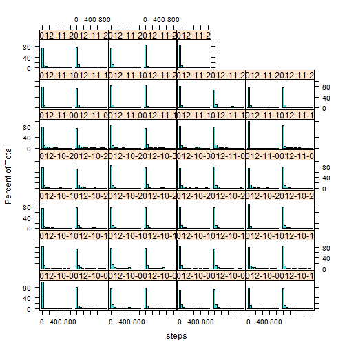

# Reproducible Research: Peer Assessment 1

## Loading and preprocessing the data

Calling `Sys.setlocale()` for international portability


```r
Sys.setlocale("LC_TIME", "English")
```

```
## [1] "English_United States.1252"
```

Calling read.csv() using default values, keeping only complete cases for now. Reading dates as such with `as.Date()`


```r
data <- read.csv("activity.csv")
data[,2] <- as.Date(data[,2], format="%Y-%m-%d")
comp <- complete.cases(data)
comp <- data[comp,]
```

## What is mean total number of steps taken per day?

Total number of steps correspond to the 1st column:


```r
names(comp)
```

```
## [1] "steps"    "date"     "interval"
```

```r
names(comp[1])
```

```
## [1] "steps"
```

Which allows us to calculate the meanS and medians of the total number of steps taken (omitting the NAs) per day. We can also plot a histogram of the number of steps taken per day :


```r
library(lattice)
histogram(~steps|date, data=comp)
```

 

```r
means <- tapply(comp$steps,comp$date,mean)
medians <- tapply(comp$steps,comp$date,median)
means
```

```
## 2012-10-02 2012-10-03 2012-10-04 2012-10-05 2012-10-06 2012-10-07 
##     0.4375    39.4167    42.0694    46.1597    53.5417    38.2465 
## 2012-10-09 2012-10-10 2012-10-11 2012-10-12 2012-10-13 2012-10-14 
##    44.4826    34.3750    35.7778    60.3542    43.1458    52.4236 
## 2012-10-15 2012-10-16 2012-10-17 2012-10-18 2012-10-19 2012-10-20 
##    35.2049    52.3750    46.7083    34.9167    41.0729    36.0938 
## 2012-10-21 2012-10-22 2012-10-23 2012-10-24 2012-10-25 2012-10-26 
##    30.6285    46.7361    30.9653    29.0104     8.6528    23.5347 
## 2012-10-27 2012-10-28 2012-10-29 2012-10-30 2012-10-31 2012-11-02 
##    35.1354    39.7847    17.4236    34.0938    53.5208    36.8056 
## 2012-11-03 2012-11-05 2012-11-06 2012-11-07 2012-11-08 2012-11-11 
##    36.7049    36.2465    28.9375    44.7326    11.1771    43.7778 
## 2012-11-12 2012-11-13 2012-11-15 2012-11-16 2012-11-17 2012-11-18 
##    37.3785    25.4722     0.1424    18.8924    49.7882    52.4653 
## 2012-11-19 2012-11-20 2012-11-21 2012-11-22 2012-11-23 2012-11-24 
##    30.6979    15.5278    44.3993    70.9271    73.5903    50.2708 
## 2012-11-25 2012-11-26 2012-11-27 2012-11-28 2012-11-29 
##    41.0903    38.7569    47.3819    35.3576    24.4688
```

```r
medians
```

```
## 2012-10-02 2012-10-03 2012-10-04 2012-10-05 2012-10-06 2012-10-07 
##          0          0          0          0          0          0 
## 2012-10-09 2012-10-10 2012-10-11 2012-10-12 2012-10-13 2012-10-14 
##          0          0          0          0          0          0 
## 2012-10-15 2012-10-16 2012-10-17 2012-10-18 2012-10-19 2012-10-20 
##          0          0          0          0          0          0 
## 2012-10-21 2012-10-22 2012-10-23 2012-10-24 2012-10-25 2012-10-26 
##          0          0          0          0          0          0 
## 2012-10-27 2012-10-28 2012-10-29 2012-10-30 2012-10-31 2012-11-02 
##          0          0          0          0          0          0 
## 2012-11-03 2012-11-05 2012-11-06 2012-11-07 2012-11-08 2012-11-11 
##          0          0          0          0          0          0 
## 2012-11-12 2012-11-13 2012-11-15 2012-11-16 2012-11-17 2012-11-18 
##          0          0          0          0          0          0 
## 2012-11-19 2012-11-20 2012-11-21 2012-11-22 2012-11-23 2012-11-24 
##          0          0          0          0          0          0 
## 2012-11-25 2012-11-26 2012-11-27 2012-11-28 2012-11-29 
##          0          0          0          0          0
```

## What is the average daily activity pattern?


```r
mean_stp_intrvl <- tapply(comp$steps,comp$interval,mean)
xyplot(mean_stp_intrvl~interval,data=comp,type="l",ylab="Average number of steps")
```

 

```r
max_interval <- names(mean_stp_intrvl[mean_stp_intrvl==max(mean_stp_intrvl)])
max_interval
```

```
## [1] "835"
```

The 5 minutes-interval with the maximum number of steps corresponds to interval #835
 on average across all days.

## Imputing missing values

By summing the results of the function is.na over the all dataset we can calculate the number of missing values. All of them come from the first column of this dataset (number of steps).

```r
sum(is.na(data))
```

```
## [1] 2304
```

```r
sum(is.na(data$steps))
```

```
## [1] 2304
```

I then decided to substitute the NAs with the mean value for the corresponding interval


```r
data$steps[is.na(data$steps)] <- mean_stp_intrvl[as.character(data$interval[is.na(data$steps)])]
head(data$steps)
```

```
## [1] 1.71698 0.33962 0.13208 0.15094 0.07547 2.09434
```

```r
head(mean_stp_intrvl)
```

```
##       0       5      10      15      20      25 
## 1.71698 0.33962 0.13208 0.15094 0.07547 2.09434
```
I now got my dataset `data` free of NA values


```r
sum(is.na(data))
```

```
## [1] 0
```


```r
histogram(~steps|date, data=data)
```

 

```r
means <- tapply(data$steps,data$date,mean)
medians <- tapply(data$steps,data$date,median)
means
```

```
## 2012-10-01 2012-10-02 2012-10-03 2012-10-04 2012-10-05 2012-10-06 
##    37.3826     0.4375    39.4167    42.0694    46.1597    53.5417 
## 2012-10-07 2012-10-08 2012-10-09 2012-10-10 2012-10-11 2012-10-12 
##    38.2465    37.3826    44.4826    34.3750    35.7778    60.3542 
## 2012-10-13 2012-10-14 2012-10-15 2012-10-16 2012-10-17 2012-10-18 
##    43.1458    52.4236    35.2049    52.3750    46.7083    34.9167 
## 2012-10-19 2012-10-20 2012-10-21 2012-10-22 2012-10-23 2012-10-24 
##    41.0729    36.0938    30.6285    46.7361    30.9653    29.0104 
## 2012-10-25 2012-10-26 2012-10-27 2012-10-28 2012-10-29 2012-10-30 
##     8.6528    23.5347    35.1354    39.7847    17.4236    34.0938 
## 2012-10-31 2012-11-01 2012-11-02 2012-11-03 2012-11-04 2012-11-05 
##    53.5208    37.3826    36.8056    36.7049    37.3826    36.2465 
## 2012-11-06 2012-11-07 2012-11-08 2012-11-09 2012-11-10 2012-11-11 
##    28.9375    44.7326    11.1771    37.3826    37.3826    43.7778 
## 2012-11-12 2012-11-13 2012-11-14 2012-11-15 2012-11-16 2012-11-17 
##    37.3785    25.4722    37.3826     0.1424    18.8924    49.7882 
## 2012-11-18 2012-11-19 2012-11-20 2012-11-21 2012-11-22 2012-11-23 
##    52.4653    30.6979    15.5278    44.3993    70.9271    73.5903 
## 2012-11-24 2012-11-25 2012-11-26 2012-11-27 2012-11-28 2012-11-29 
##    50.2708    41.0903    38.7569    47.3819    35.3576    24.4688 
## 2012-11-30 
##    37.3826
```

```r
medians
```

```
## 2012-10-01 2012-10-02 2012-10-03 2012-10-04 2012-10-05 2012-10-06 
##      34.11       0.00       0.00       0.00       0.00       0.00 
## 2012-10-07 2012-10-08 2012-10-09 2012-10-10 2012-10-11 2012-10-12 
##       0.00      34.11       0.00       0.00       0.00       0.00 
## 2012-10-13 2012-10-14 2012-10-15 2012-10-16 2012-10-17 2012-10-18 
##       0.00       0.00       0.00       0.00       0.00       0.00 
## 2012-10-19 2012-10-20 2012-10-21 2012-10-22 2012-10-23 2012-10-24 
##       0.00       0.00       0.00       0.00       0.00       0.00 
## 2012-10-25 2012-10-26 2012-10-27 2012-10-28 2012-10-29 2012-10-30 
##       0.00       0.00       0.00       0.00       0.00       0.00 
## 2012-10-31 2012-11-01 2012-11-02 2012-11-03 2012-11-04 2012-11-05 
##       0.00      34.11       0.00       0.00      34.11       0.00 
## 2012-11-06 2012-11-07 2012-11-08 2012-11-09 2012-11-10 2012-11-11 
##       0.00       0.00       0.00      34.11      34.11       0.00 
## 2012-11-12 2012-11-13 2012-11-14 2012-11-15 2012-11-16 2012-11-17 
##       0.00       0.00      34.11       0.00       0.00       0.00 
## 2012-11-18 2012-11-19 2012-11-20 2012-11-21 2012-11-22 2012-11-23 
##       0.00       0.00       0.00       0.00       0.00       0.00 
## 2012-11-24 2012-11-25 2012-11-26 2012-11-27 2012-11-28 2012-11-29 
##       0.00       0.00       0.00       0.00       0.00       0.00 
## 2012-11-30 
##      34.11
```

The impact of the missing data on the means and the medians for each day is relatively low as the number of missing values was. 

## Are there differences in activity patterns between weekdays and weekends?

Creating a vector `days` and assigning weekend days to `TRUE` and week days to `FALSE`. I then had to replace this logical vector with corresponding character (there definitely exists a more elegant solution I believe).

By calling the function `with` I get the average number of steps per interval and per week day type (weekend/weekday). I finally plot the results using the base plotting system.


```r
days <- weekdays(data[,2])=="Saturday" | weekdays(data[,2])=="Sunday"
days[days==TRUE] <- "weekend"
days[days=="FALSE"] <- "weekday"
data <- transform(data,days=days)
df <- data.frame(with(data, tapply(steps, list(interval, days), mean)))
par(mfcol=c(2,1),mar=c(4,4,4,2))
plot(unique(data$interval),df[,2],type="l",main="weekend",xlab="Interval",ylab="Average number of steps",col=2)
plot(unique(data$interval),df[,1],type="l",main="weekday",xlab="Interval",ylab="Average number of steps",col=4)
```

 
